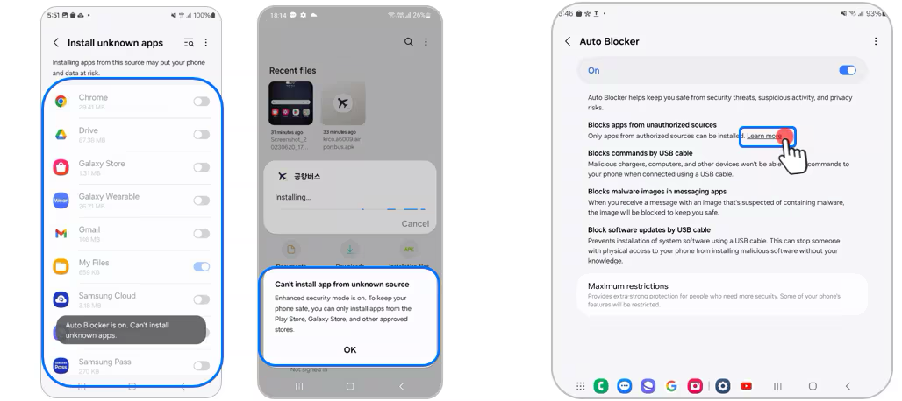

# Way2Masjid APK Releases

Welcome to the Way2Masjid APK distribution repository! Due to Play Store restrictions, we're providing direct APK downloads for all our app variants.

## Available Apps

### 📱 Way2Masjid Imam
**File:** `way2masjid_imam.apk`
- **Purpose:** For mosque imams and religious leaders
- **Features:** Manage prayer times, announcements, and community updates

[📥 Download Imam App](https://github.com/fouzapps/public-releases/releases/download/latest/way2masjid_imam.apk)

### 👥 Way2Masjid User
**File:** `way2masjid_user.apk`
- **Purpose:** For regular users and community members
- **Features:** Find nearby mosques, prayer times, and community events

[📥 Download User App](https://github.com/fouzapps/public-releases/releases/download/latest/way2masjid_user.apk)

<!-- ### 💼 Way2Masjid Executive
**File:** `way2masjid_executive.apk`
- **Purpose:** For mosque executives and administrators
- **Features:** Administrative tools, reporting, and management functions

[📥 Download Executive App](releases/way2masjid_executive.apk) -->

---

## Installation Guide

### ⚠️ Important Notice
Chrome and other browsers may initially block APK downloads as a security measure. This is normal behavior for sideloaded apps.

### Step-by-Step Installation

#### 1. Download the APK
- Click on the download link for your desired app version
- If Chrome shows a warning, click "Keep" or "Download anyway"
- The APK will be saved to your Downloads folder

#### 2. Enable Unknown Sources
Before installing, you need to allow installation from unknown sources:

**For Android 8.0+ (Oreo and newer):**
1. Go to **Settings** → **Apps & notifications** → **Special app access**
2. Select **Install unknown apps**
3. Choose your browser (Chrome/Firefox) or file manager
4. Toggle **Allow from this source**

**For Android 7.1 and older:**
1. Go to **Settings** → **Security**
2. Enable **Unknown sources**
3. Confirm the action

#### 3. Install the APK
1. Open your **Downloads** folder or notification panel
2. Tap on the downloaded APK file
3. If prompted, confirm installation permissions
4. Tap **Install**
5. Wait for installation to complete
6. Tap **Open** to launch the app

#### 4. Post-Installation
- You can disable "Unknown sources" after installation for security
- The app will appear in your app drawer like any other app
- Updates will need to be downloaded manually from this repository

#### 5. For Samsung Devices

Samsung devices running One UI 6.0 and above may have a security feature called **Auto Blocker** that can prevent the installation of APK files from outside the Play Store. If you see a warning like the one below when trying to install the APK, you need to temporarily disable Auto Blocker:

**How to Disable Auto Blocker on Samsung Devices:**

1. Open the **Settings** app on your Samsung device.
2. Scroll down and tap on **Security and privacy**.
3. Tap on **Auto Blocker**.
4. Toggle **Auto Blocker** off (you may need to enter your device PIN or pattern).
5. Proceed with the APK installation as described above.
6. Once installation is complete, you can return to **Settings** and re-enable **Auto Blocker** for maximum security.

**Note:** Disabling Auto Blocker is only recommended while installing trusted APKs from this official repository. Always re-enable it after installation to keep your device protected.

### 🔒 Security Notes
- These APKs are officially signed by the Way2Masjid development team
- Always download from this official repository
- Verify the file size and version before installation
- Keep your device's security settings enabled after installation

### 📱 System Requirements
- **Android Version:** 5.0 (API level 21) or higher
- **Storage:** At least 50MB free space
- **RAM:** 2GB recommended
- **Internet:** Required for full functionality

### 🆘 Troubleshooting

**Installation Failed:**
- Ensure you have enough storage space
- Check that "Unknown sources" is enabled
- Try restarting your device and installing again

**App Won't Open:**
- Verify your Android version meets requirements
- Clear cache and try again
- Ensure stable internet connection

**Download Issues:**
- Try using a different browser
- Check your internet connection
- Clear browser cache and cookies

---

## Version Information

| App        | Version | Last Updated |
|------------|---------|--------------|
| Imam       | 1.0.0   | [Date]       |
| User       | 1.0.0   | [Date]       |
<!-- | Executive  | 1.0.0   | [Date]       | -->

### 🔄 Updates
- Check this repository regularly for new releases
- We'll announce major updates through our official channels
- Consider starring this repository to get notifications

---

**Note:** These APKs are provided as an alternative to Play Store distribution. Always ensure you're downloading from this official source to maintain security and authenticity.